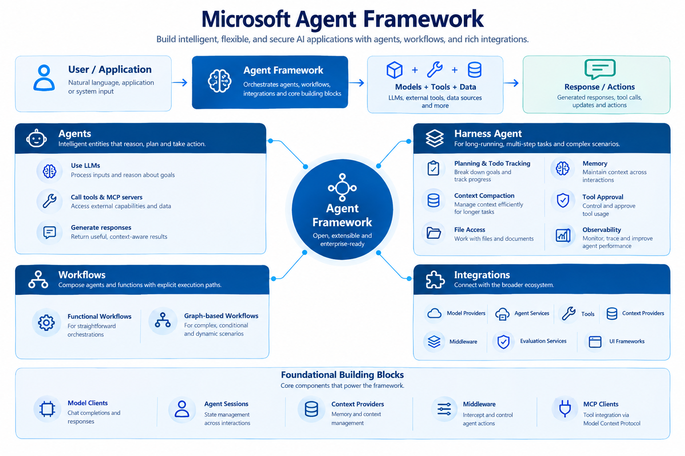

# Microsoft Agent Framework



Agent framework brings together:
- **Agents** - Individual agents that use LLMs to process inputs, call tools and MCP servers, and generate responses.
- **Harness Agent** - 
- **Workflows** - Functional and graph-based workflows that connect agents and functions through explicit execution paths.
- **Integrations** - Connections to model providers, agent services, tools, context providers, middleware, evaluation services, and UI frameworks, organized by provider and component.

The framework also provides a set of foundational building blocks for developing AI applications, including:

- Model clients for chat completions and responses.
- Agent sessions for state management.
- Context providers for memory.
- Middleware for intercepting and controlling agent actions, and
- MCP clients for tool integration

Together, these capabilities provide the flexibility, extensibility, and control needed to build interactive, robust, and secure enterprise grade AI applications.

## Get Started

``` bash
pip install agent-framework
```


For more detailes please refer [MS Lean - Agent Frameowrk](https://learn.microsoft.com/en-us/agent-framework/overview/?pivots=programming-language-python)

